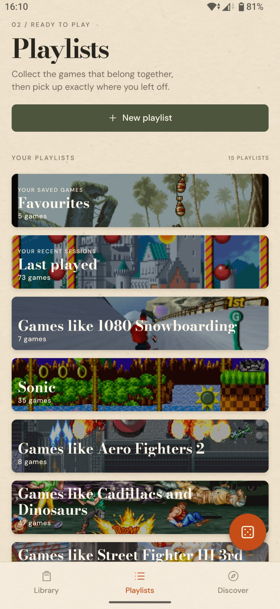
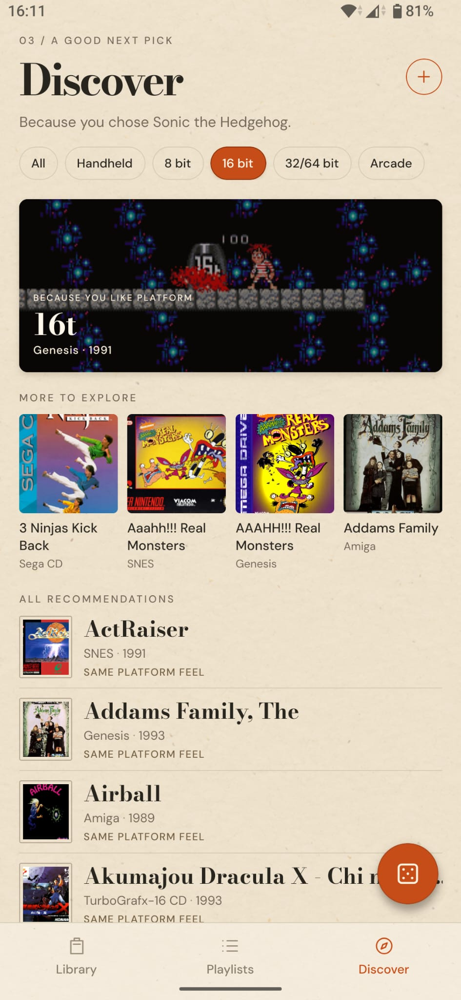
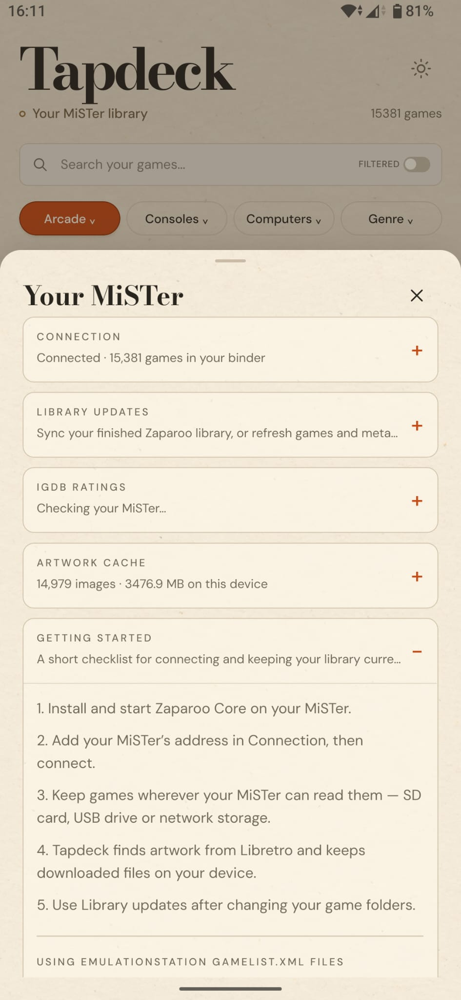

<p align="center">
  
</p>

<h1 align="center">Tapdeck</h1>

<p align="center">
  <strong>Your MiSTer library, in your pocket.</strong><br />
  A beautiful, fast way to browse, rediscover and launch the games you already own.
</p>

<p align="center">
  <a href="https://github.com/MiSTerTapdeck/Tapdeck/releases">Download for Android</a>
  ·
  <a href="#getting-started">Getting started</a>
  ·
  <a href="#mister-setup">MiSTer setup</a>
  ·
  <a href="./CHANGELOG.md">Changes</a>
  ·
  <a href="./docs/storage-safety.md">Storage safety</a>
</p>

<p align="center">
  <a href="./docs/screenshots/game%20list.jpeg"></a>
  <a href="./docs/screenshots/game%20cards.jpeg"></a>
  <a href="./docs/screenshots/card%20front.jpeg"></a>
  <a href="./docs/screenshots/card%20back.jpeg"></a>
</p>
<p align="center">
  <a href="./docs/screenshots/playlists.jpeg"></a>
  <a href="./docs/screenshots/discover.jpeg"></a>
  <a href="./docs/screenshots/settings.jpeg"></a>
</p>

## Your collection deserves better than a folder browser

Tapdeck turns a MiSTer library into a tactile game binder. Browse cover art, screenshots and metadata; filter across systems and genres; make playlists; find something you have not played in years; then launch it on your MiSTer from the sofa.

It is built for large, mixed MiSTer libraries: arcade boards, consoles, computers, CD-based systems and custom MGL launches all belong in one place.

## Trust, storage and source code

Tapdeck is currently distributed as a side-loaded Android APK. If you prefer not to install a side-loaded app, please wait for a future store or independent Android repository release.

The complete source is public under the [MIT License](./LICENSE). You may use, modify and redistribute the code, provided the licence notice is retained. Some game artwork and metadata originate from third-party sources and are not granted by this licence.

Tapdeck does not mount, unmount, disable, format or alter MiSTer storage. Its USB recovery only performs read-only path checks when a drive has been assigned a different `/media/usbN` slot after reboot. The exact behaviour and the optional helper changes are documented in [Storage safety](./docs/storage-safety.md).

## What it does

- **A library you can actually browse** — list and three-column card views, fast search, system and genre filters, sorting, favourites and Last Played.
- **Make your own shelves** — create playlists, add games in batches, and put together a queue for any mood or hardware setup.
- **Artwork that gets out of the way** — local artwork caching, Libretro thumbnail support and graceful fallbacks when a title has no art.
- **Discover what to play next** — recommendations based on your library, platform groupings and cached ratings.
- **Metadata where it helps** — game details from your MiSTer library, with optional IGDB ratings for titles that have no rating in their gamelist.
- **Launch from the phone** — Tapdeck sends launch requests through MiSTer Remote, including direct MGL launches for systems outside the usual mappings.
- **Made for use in the room** — haptic feedback, full-screen game cards and Android back navigation.
- **Light or dark, by choice** — switch the reading surface in Settings → Appearance. Tapdeck remembers the choice on the device.

## Getting started

1. Download the latest APK from [Releases](https://github.com/MiSTerTapdeck/Tapdeck/releases).
2. Open it on an Android phone or tablet and allow your browser or file manager to install apps when Android asks.
3. Put the phone and MiSTer on the same home network.
4. Open Tapdeck, enter your MiSTer’s IP address, then connect and sync the library.

Tapdeck remembers the connection and keeps a local copy of the library so the binder opens quickly.

## MiSTer setup

Tapdeck uses two separate MiSTer services for different jobs:

- **Zaparoo Core** indexes the library and supplies its paths and metadata.
- **MiSTer Remote** performs the actual game launch requests.

Install and run both before connecting Tapdeck. Tapdeck does not launch games through Zaparoo.

Some additions are optional:

- [AmigaVision bridge](./integrations/amigavision-bridge/package/README.md) — required only for launching directly into an AmigaVision game.
- [IGDB metadata bridge](./integrations/igdb-metadata-bridge/README.md) — optional local helper that caches ratings for games whose gamelist has no rating.

## A note on artwork and metadata

Tapdeck reads the metadata already available in your MiSTer library. It can download matching artwork to the Android device, so cover art becomes faster after its first use. If a game has no metadata or artwork, it stays visible and usable.

The optional IGDB bridge runs on the MiSTer. It is only used when you choose to configure it, and its rating cache stays on the MiSTer.

## Development

Requires Node.js 24 LTS.

```sh
npm ci
npm start
```

Run these before submitting a change or making a build:

```sh
npm run typecheck
npm test
```

The web preview is useful for layout checks. Test MiSTer connection, artwork refresh, launch and gestures on a physical Android device before publishing an APK.

## Building an Android APK

For the signed installable release APK:

```sh
npx eas-cli build --platform android --profile release
```

For private testing, use the `preview` profile instead. Release APKs are attached to the project’s [GitHub Releases](https://github.com/MiSTerTapdeck/Tapdeck/releases) page.

## Project layout

- `src/` — native app screens, components and library/launch logic.
- `integrations/` — optional MiSTer-side helpers for AmigaVision and IGDB metadata.
- `tests/` — regression tests for library handling, artwork, playlists, discovery and launch routing.
- `scripts/` — maintenance tools for sample content and artwork indexes.
